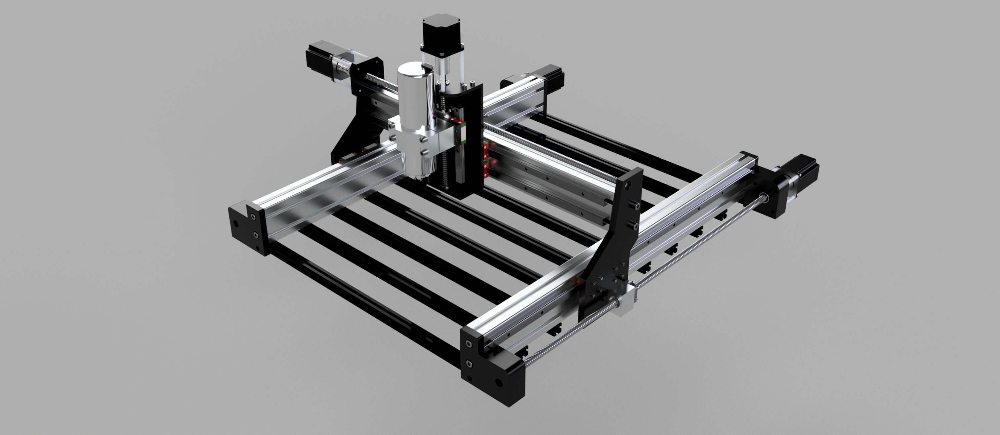

# Lambda CNC Router

## Description

Lambda v2 is a versatile and open-source CNC router designed with accessibility and functionality in mind. Crafted by I'M Robotics Lab, it features a robust design incorporating 3D-printed ABS components for durability and affordability. With a spacious workable area of approximately 600x400 mm, Lambda can handle a variety of materials, including wood, aluminum, brass, plexiglass, and plastic, making it ideal for diverse machining projects. The router is powered by the BlackBox X32 motion controller and utilizes OpenBuild control software, ensuring precise operation and a user-friendly interface. Lambda is designed for straightforward assembly, empowering users to gain valuable hands-on experience in CNC building and repair. Priced around $1,300, Lambda offers exceptional value. For those looking to further reduce costs, the BlackBox control system can be replaced with more affordable alternatives. Lambda combines reliability, customizability, and education, making it the perfect tool for makers, hobbyists, and educators alike. This product is protected under the CC BY-NC-SA 4.0.

## Features

- **Workable Area:** 600x400 mm
- **Double Linear Rails**
- **Ball Screws**
- **Machinable Materials:** Wood, Aluminum, Brass, Plexiglass, Plastic
- **Customizable Frame**
- **Motion Controller:** Black Box X32
- **Software:** OpenBuild control software
- **Supports Many Spindles/Routers**
- **Motors:** Nema 23 High Torque Motors
- **Cutting Speed:** 3000 mm/min
- **Cost:** ~$1300 (with potential for reduction)

## License

Lambda is protected under the [CC BY-NC-SA 4.0](https://creativecommons.org/licenses/by-nc-sa/4.0/).

## Contact

For more information, visit [I'M Robotics Lab](https://www.imroboticslab.com/) or contact us at [imlabsbusiness@gmail.com](mailto:imlabsbusiness@gmail.com).
